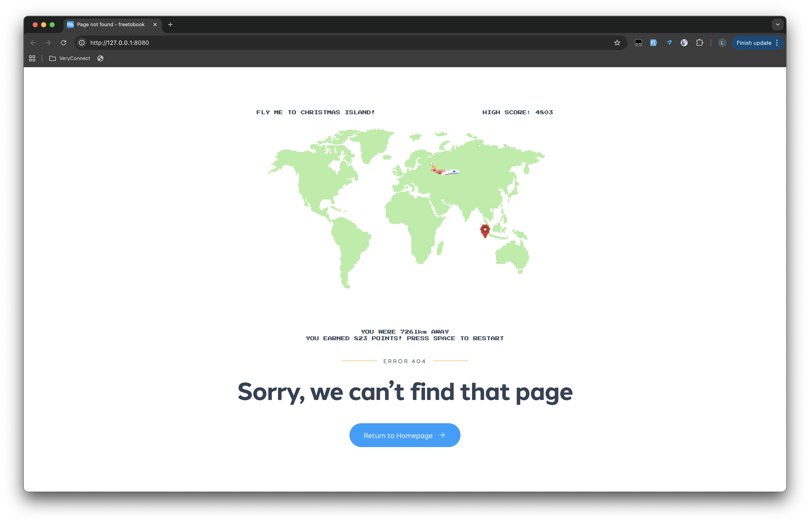

  

# GUTS Hackathon 2025

## Challenge

Build a small browser-based game that we could show to our users on error page. Imagine Chrome's no internet dino game, masswerks 404 tic tac toe game, figmas 404 shape editor.

The game should be:

- Lightweight and quick to load
- Capable of running offline
- Easy to understand
    - Simple controls
    - Minimal instructions needed
- Creative and fun

Bonus points!

- Themed around the travel industry
- Using freetobook's colour scheme

## Our Solution

Geoguesser meets Claw Machine? It's a simple one control game where the user will guess where a given Country is on the provided map, it'll give a distance from the pin and an associated score.

It's a custom web component, coded in pure JS to ensure it's lightweight and doesn't have any bloat.
